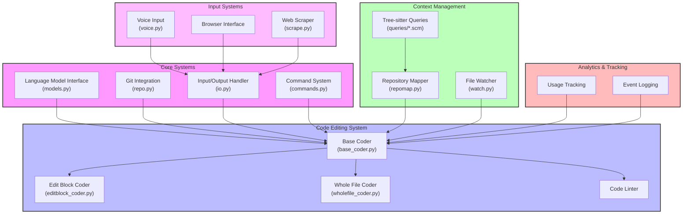

# Aider Technical Architecture

## Component Descriptions

### Core Systems
- **Language Model Interface**: Manages interactions with LLMs (GPT, Claude), handles model configurations and responses
- **Git Integration**: Handles repository operations, commit management, and file tracking
- **Input/Output Handler**: Manages user interactions, console output, and file I/O operations
- **Command System**: Processes user commands, manages chat modes, and coordinates system operations

### Code Editing System
- **Base Coder**: Abstract base class providing core editing functionality and model interaction
- **Edit Block Coder**: Implements search/replace block-based code modifications
- **Whole File Coder**: Handles entire file modifications and updates
- **Code Linter**: Provides code quality checking and automatic fixes

### Context Management
- **Repository Mapper**: Generates and manages repository file mappings and context
- **Tree-sitter Queries**: Language-specific syntax parsing for code understanding
- **File Watcher**: Monitors source files for changes and modifications

### Input Systems
- **Voice Input**: Handles voice-based code input and commands
- **Browser Interface**: Manages web-based interactions and UI
- **Web Scraper**: Retrieves and processes web content

### Analytics & Tracking
- **Usage Tracking**: Monitors system usage and performance
- **Event Logging**: Records user interactions and system events

## Key Features
1. Multi-language support through tree-sitter queries
2. Flexible editing strategies (block-based and whole-file)
3. Git integration with automatic commits
4. Multiple input methods (text, voice, browser)
5. Comprehensive context management
6. Built-in code quality tools

## Data Flow
1. User input (command/code) → Input/Output Handler
2. Command processing → Command System
3. Code modification request → Base Coder
4. Context gathering → Repository Mapper
5. Code parsing → Tree-sitter Queries
6. Model interaction → Language Model Interface
7. File modifications → Git Integration
8. Usage tracking → Analytics System

## Installation & Dependencies
- Python 3.9+ required
- Key dependencies: tree-sitter, git, LLM APIs
- Optional: playwright for web scraping
