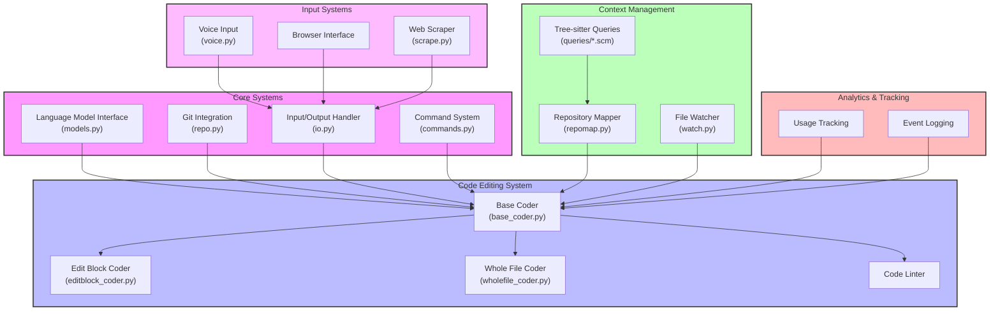

# Aider Technical Architecture



## Component Descriptions

### Core Systems
- **Language Model Interface**: Manages interactions with LLMs (GPT, Claude), handles model configurations and responses
- **Git Integration**: Handles repository operations, commit management, and file tracking
- **Input/Output Handler**: Manages user interactions, console output, and file I/O operations
- **Command System**: Processes user commands, manages chat modes, and coordinates system operations

### Dual Model Flow (Experimental)
The system features an experimental dual-model approach that separates code generation into two specialized phases. Here's how it's implemented:

#### Core Implementation

1. Editor Model Selection (in `architect_coder.py:22-24`):
```python
# Use the editor_model from the main_model if it exists, otherwise use the main_model itself
editor_model = self.main_model.editor_model or self.main_model
kwargs["main_model"] = editor_model
kwargs["edit_format"] = self.main_model.editor_edit_format
```

2. Model Configuration (in `models.py`):
```python
@dataclass
class ModelSettings:
    name: str
    edit_format: str = "whole"
    editor_model_name: Optional[str] = None      # Specifies the model to use for editing
    editor_edit_format: Optional[str] = None     # Specifies the edit format for editor model
```

3. Example Configuration:
```python
ModelSettings(
    "openai/gpt-4o",
    "diff",
    editor_model_name="gpt-4o",
    editor_edit_format="editor-diff"
)
```

4. Editor Model Creation (in `models.py:1058-1076`):
```python
def get_editor_model(self, provided_editor_model_name, editor_edit_format):
    # Override model settings if provided
    if provided_editor_model_name:
        self.editor_model_name = provided_editor_model_name
    if editor_edit_format:
        self.editor_edit_format = editor_edit_format

    # Use self as editor if no specific editor model is configured
    if not self.editor_model_name or self.editor_model_name == self.name:
        self.editor_model = self
    else:
        # Create new Model instance for editing
        self.editor_model = Model(
            self.editor_model_name,
            editor_model=False,
        )

    # Use editor model's default format if none specified
    if not self.editor_edit_format:
        self.editor_edit_format = self.editor_model.edit_format

    return self.editor_model
```

### Quick Start Guide: Using Dual Models

To enable and use the experimental dual model system:

1. **Model Selection**
   - Use an architect-capable model as your main model:
     ```bash
     aider --model o1-preview  # Uses gpt-4o as editor by default
     # or
     aider --model claude-3-sonnet-20240229  # Uses claude-3-5-haiku as editor
     ```

2. **Configuration Options**
   The system supports various model combinations:
   - OpenAI Models:
     ```python
     # o1-preview with gpt-4o editor
     ModelSettings(
         "o1-preview",
         "architect",
         editor_model_name="gpt-4o",
         editor_edit_format="editor-diff"
     )
     ```
   - Anthropic Models:
     ```python
     # claude-3-sonnet with haiku editor
     ModelSettings(
         "claude-3-sonnet-20240229",
         "diff",
         editor_model_name="claude-3-5-haiku-20241022",
         editor_edit_format="whole"
     )
     ```

3. **Verification**
   - The system will announce when it switches between Architect and Editor modes
   - You can observe the two-phase process:
     1. Architect model provides solution strategy
     2. Editor model implements specific changes

1. **Architect Model** (`aider/coders/architect_coder.py`)
   - Acts as a high-level system architect
   - Analyzes change requests and current codebase context
   - Provides strategic solution descriptions
   - Uses specialized prompts from `aider/coders/architect_prompts.py`

2. **Editor Model** (`aider/coders/editor_whole_coder.py`)
   - Receives solution descriptions from the Architect
   - Translates high-level plans into specific code changes
   - Implements precise modifications
   - Uses specialized prompts from `aider/coders/editor_whole_prompts.py`

The dual model system is configured through `aider/models.py`, which defines:
- Model selection for both roles
- Edit format specifications
- Inter-model communication parameters

This separation enables:
- More thoughtful and structured modifications
- Clear distinction between architecture and implementation
- Specialized expertise at each stage
- Flexible model selection based on task requirements

### Code Editing System
- **Base Coder**: Abstract base class providing core editing functionality and model interaction
- **Edit Block Coder**: Implements search/replace block-based code modifications
- **Whole File Coder**: Handles entire file modifications and updates
- **Code Linter**: Provides code quality checking and automatic fixes

### Context Management
- **Repository Mapper**: Generates and manages repository file mappings and context
- **Tree-sitter Queries**: Language-specific syntax parsing for code understanding
- **File Watcher**: Monitors source files for changes and modifications

### Input Systems
- **Voice Input**: Handles voice-based code input and commands
- **Browser Interface**: Manages web-based interactions and UI
- **Web Scraper**: Retrieves and processes web content

### Analytics & Tracking
- **Usage Tracking**: Monitors system usage and performance
- **Event Logging**: Records user interactions and system events

## Key Features
1. Multi-language support through tree-sitter queries
2. Flexible editing strategies (block-based and whole-file)
3. Git integration with automatic commits
4. Multiple input methods (text, voice, browser)
5. Comprehensive context management
6. Built-in code quality tools

## Data Flow
1. User input (command/code) → Input/Output Handler
2. Command processing → Command System
3. Code modification request → Base Coder
4. Context gathering → Repository Mapper
5. Code parsing → Tree-sitter Queries
6. Model interaction → Language Model Interface
7. File modifications → Git Integration
8. Usage tracking → Analytics System

## Installation & Dependencies
- Python 3.9+ required
- Key dependencies: tree-sitter, git, LLM APIs
- Optional: playwright for web scraping
